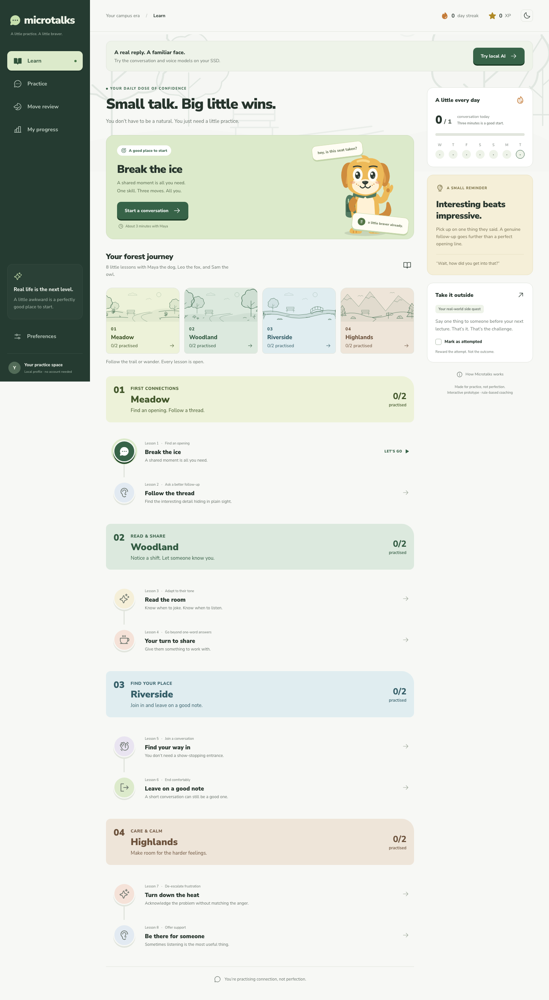
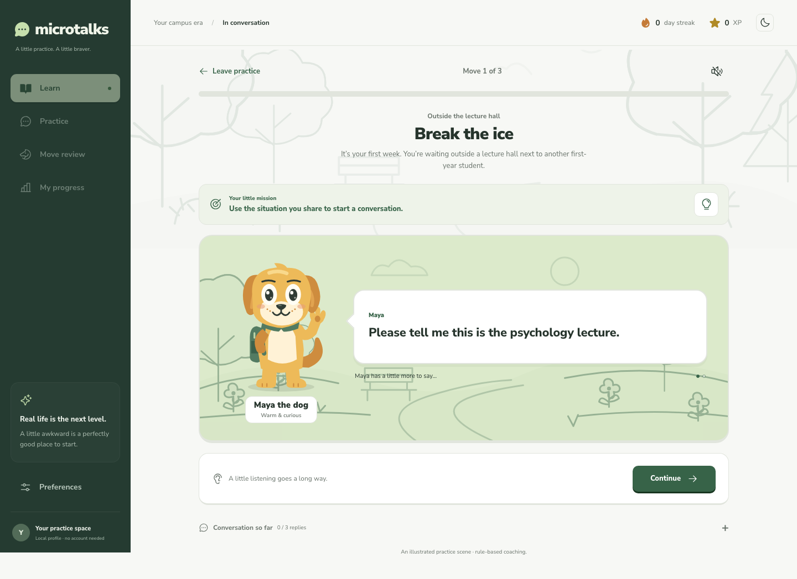
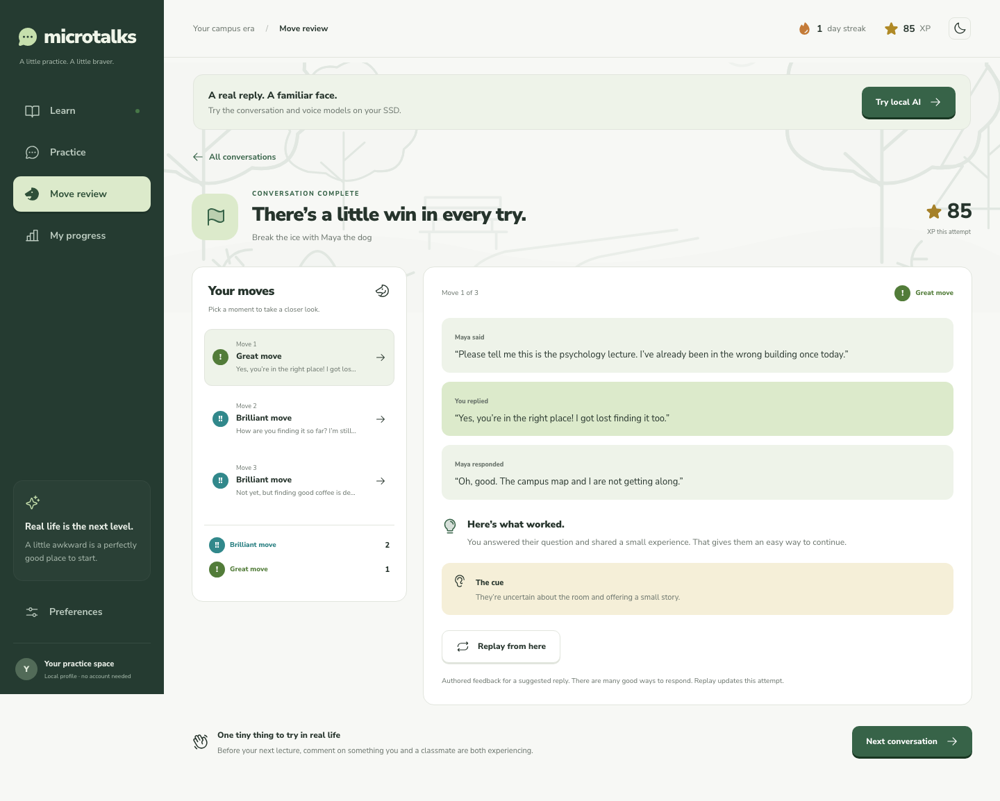
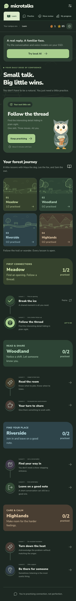

# Microtalks

**Paused mid-refactor:** read **[HANDOFF.md](HANDOFF.md)** before building or restarting. The SSD has been ejected, and the latest all-lessons/live-only unification is incomplete. **[LAYA_EVALUATION.md](LAYA_EVALUATION.md)** contains the researched classifier proposal. Earlier feature and test descriptions below refer to the last working version unless the handoff says otherwise.

A playable small-talk training prototype for university life. React, TypeScript, and Vite, with an optional local Python backend for SSD-hosted AI. No account or API key required.

## Screenshots

| Home | Conversation |
|---|---|
|  |  |
| **Move review** | **Mobile, dark** |
|  |  |

## Try the connected SSD models

Keep **Extreme SSD** mounted, then run from this project:

```sh
bash scripts/start-local-web.sh
```

Open **http://127.0.0.1:8765**, choose **Try local AI**, select a character and **Text** or **Local voice**, and start. Use **Hear Maya/Leo/Sam** to preview the selected British voice first. The authored opening sets the scene; subsequent replies come from **Qwen3.5 9B**. The interface displays the actual model and distinguishes loaded models from on-demand speech components.

Inside a Local voice scene, choose **Start live practice**. The character reads its whole reply, then the microphone opens. Local activity/pause detection submits your turn automatically after a selectable 1.2, 1.6, or 2.4-second pause. Whisper supplies partial transcript updates roughly every few seconds and a final transcript at the endpoint. Voice text is read-only; Live attempts have no edit/revert/replay action. You can pause, finish, or start a fresh attempt. A physical microphone test is still useful in your own room: this prototype uses lightweight energy-based endpoint detection, not a neural speech-versus-noise classifier or full-duplex interruption model.

Silence before speech never submits an empty turn. After 20 seconds without detected speech, Live practice pauses. Each recorded turn is limited to 45 seconds. Local inference still adds processing pauses; it does not provide ChatGPT-equivalent streaming latency.

**Each reply receives a live move rating and explanation.** A “Reviewing your response…” card appears while the coach works; you can continue. Ratings stay attached to the correct turn even when they arrive out of order. Conversations allow up to **six** exchanges and can end much earlier. **Review my moves** opens existing ratings, waiting for any remaining review; **Save now** saves immediately and leaves unfinished reviews unrated.

New local attempts award **15 participation XP per reply** (up to 90 per session), independent of model ratings. In Live practice only, repeated detected transcript fillers can deduct 1–3 delivery XP: the first two are tolerated, a deduction requires a high filler proportion, and it is capped at three. Meaningful uses of “like” are not deliberately penalized. This is a coaching heuristic, not a clinically validated fluency standard. Speech recognition can omit fillers.

Delivery reports separately show approximate pace and pitch variation when enough voiced audio exists. Narrow or wide pitch range can prompt an observation, but is never treated as proof of emotion or given a tone penalty. Unsupported coaching evidence stays unrated. Coached text attempts retain replay; Live-voice attempts start afresh instead. The grader receives explicit PARTNER and LEARNER fields.

## The cast and the forest journey

- **Maya, the dog:** warm, curious and enthusiastic; firm when disrespected.
- **Leo, the fox:** cautious at first, then playfully witty. Defaults to a British storyteller voice, with two alternative British voices to audition.
- **Sam, the owl:** observant, quiet and direct. Corrected two-part beak articulation replaces the earlier human-looking mouth.

These are fictional individuals inspired by animals, not claims about every member of a species. `ANIMAL_DESIGN.md` records the research and design rationale.

The eight lessons form four habitat units: **Meadow** (openings/follow-ups), **Woodland** (tone/sharing), **Riverside** (joining/exits), and **Highlands** (de-escalation/support). All lessons remain available to explore.

**Turn down the heat** practises acknowledging frustration without appeasement or matching anger. **Be there for someone** practises validation, listening, and asking what support is wanted. Characters can remain upset after a good response.

## Memory, boundaries, and coach references

Every generated turn receives the full current-session transcript, fixed character/scene facts, current character mood, and up to ten retained verbatim memory quotes. The UI exposes remembered quotes. Speaker provenance and quote text are checked against the actual transcript. New sessions start fresh; this is not cross-session personal memory.

Explicit directed insults and clear farewells take a deterministic early-ending path. Swearing about a situation or quoting an insult is handled differently from directly insulting the character. The model can also choose a natural exit. These are bounded prototype rules, not perfect intent understanding. The reply controls disappear when a conversation ends, while its final line and review remain available.

The coach retrieves concise reference notes from **eight sourced guides** indexed in SQLite FTS5 at `/Volumes/Extreme SSD/Microtalks/knowledge/coach.sqlite3`. Sources appear with feedback. This is an original-summary library, not a downloaded copy of a full book or a guarantee of correct grading. See `knowledge/README.md`.

The Python server serves the built website and `/api/local/*` endpoints on loopback port 8765. During development, Vite also proxies those endpoints to the same server. Model files and temporary recordings use the SSD; temporary audio is removed after transcription. Completed transcripts and progress remain in this browser's localStorage. Guided lessons retain the original authored engine and browser voice support.

## Run locally

Requires Node.js 22.18+ (or Node 24+) and npm.

```sh
npm install
npm run dev
```

Open the localhost URL printed by Vite (normally http://127.0.0.1:5173).

```sh
npm run build       # TypeScript checks and production bundle
npm run preview     # Serve the production bundle locally
npm test            # Scenario/scoring/storage checks
npx playwright install chromium
npm run test:e2e    # Browser flows, mobile, voice fallback, and screenshots
```

## Try the core experience

1. Start **Break the ice**, or select **Read the room** from the learning path.
2. Read your target; choose Maya, Leo, or Sam and text or voice mode.
3. Type a reply, or select **Need an idea?** to try an authored response. In voice mode, record and review your transcript before sending.
4. Complete three exchanges and choose **Review my moves**.
5. Select any move to inspect its cue and feedback. **Replay from here** preserves the earlier conversation and replaces the rest of the same attempt.

For a useful recovery example: in **Read the room**, select the “Teamwork makes the dream work” response, then the consultancy-fees joke, then the respectful goodbye. The review selects the missed serious cue automatically.

### Character-led conversations

Maya, Leo, and Sam now have original vector illustrations that appear in lesson cards, the partner chooser, and practice. During a lesson, the partner delivers one complete thought per speech bubble. Choose **Continue** to hear the next line; the reply box appears when it is your turn. After sending, a short thinking beat introduces the response. There is no countdown or automatic advance while you are reading.

Voice playback reads only the visible line and cancels when you advance. Character expressions reflect thinking, listening, speaking, and the serious library scene. Motion respects reduced-motion settings. **Conversation so far** opens the full transcript without crowding the active scene; replay still preserves the turns before the selected moment.

## Included

- Eight guided three-turn lessons plus variable-length local AI conversations: openings, follow-ups, tone, sharing, joining, endings, de-escalation, and support.
- Three selectable personalities, with persona-sensitive prototype responses.
- Free text and guided suggestions; optional browser speech recognition and text-to-speech.
- Optional live arcade ratings, post-conversation analysis, and replay from a selected turn.
- Voice filler feedback: conservative transcript detection, optional deductions capped at 6 XP per move. No silence penalties. Editing a transcript switches to text scoring.
- Browser-local session history, personal-best lesson XP, daily goal, real calendar-day streak, and a real-world challenge checkbox.
- Responsive layouts, light/dark appearance, keyboard controls, native modal focus management, and reduced-motion support.

## What is a prototype

The guided conversation engine uses **hand-authored branching content with keyword-based coaching**. The separate **Local AI** mode now uses real SSD-hosted models. Its character continuity and grading remain experimental; none of these ratings is a validated assessment of social ability.

Browser voice support varies. Chrome is a practical starting point; microphone permission and a secure origin (localhost or HTTPS) are required. The browser vendor may process speech remotely. This app does not store audio; completed transcripts and progress stay in localStorage on this browser. Speech recognition can omit fillers, so delivery feedback is explicitly approximate. Actual hardware capture and voice quality still need manual testing on your device.

Preferences currently apply for the open app session. Progress persists across reloads. History retains the most recent 60 completed attempts, so it is not a long-term analytics system. No accounts, cross-device sync, or deployed service are included.

## Files

- `IDEAS.md`: original product conversation and open questions.
- `RESEARCH.md`: competitor sources, consulted skills, design direction, and scope decisions.
- `MODEL_RESEARCH.md`: pre-installation model-table audit, classifier/reward-model research, voice candidates, and external-SSD setup guidance.
- `LOCAL_AI.md`: installed SSD runtime, measured actor/grader/voice results, and startup/benchmark commands.
- `src/engine.ts`: scenarios, personalities, feedback, and progress helpers.
- `src/App.tsx`: learning path, practice, review, voice, and local progress UI.
- `src/styles.css`: responsive design tokens and component styles.
- `src/Character.tsx`, `src/conversation.css`: original illustrated cast, campus backdrop, and paced conversation design.
- `src/LocalConversation.tsx`, `src/localApi.ts`, `public/pcm-recorder.js`, `public/audio-endpoint.js`: live voice loop, read-only partial transcripts, speech endpoints, and model UI.
- `scripts/local_server.py`: local Qwen, experimental coach, Whisper, and Kokoro endpoints.
- `scripts/conversation_state.py`: character canon, British voice choices, retained memories, and early endings.
- `scripts/delivery_metrics.py`: descriptive pitch/pace/filler observations.
- `scripts/coaching_knowledge.py`, `knowledge/guides.json`: local SQLite retrieval and original sourced coaching notes.
- `src/engine.test.ts`, `tests/`, `scripts/test_local_server.py`: executable checks.

Next model work should focus on conversation consistency and human-validated grading. The connection is implemented; the pilot benchmarks explain why its feedback remains experimental.

## Verification

Verified September 22, 2026:

- Production TypeScript/Vite build passes.
- 11 engine/audio-endpoint tests pass, including persistence of short local conversations and silence/noise/endpoint handling. Nine backend checks cover state, memory provenance, direct hostility, goodbyes, request validation, and evidence. The RAG module has ten passing checks.
- 10 regular browser tests pass, including the automatic microphone/submit loop, immutable Live review, early stopping, offline recovery, and out-of-order move ratings.
- An opt-in live browser test also passed against the installed SSD models: Chromium's simulated microphone delivered a test recording through AudioWorklet to Whisper, Qwen generated three replies, Kokoro audio played, and the model-coaching review completed. Run with `MICROTALKS_LIVE=1 npm run test:e2e -- --grep "live SSD models" --workers=1` while the local server is running.
- Desktop, mobile, conversation, and review screenshots were inspected. Screenshots are generated in `test-results/` by the browser suite.
- Before the character-led redesign, a local production-home-page Lighthouse run scored performance **97**, accessibility **100**, best practices **100**. These historical scores are automated local checks, not a comprehensive accessibility certification or field performance measurement.
- Physical microphone acoustics and subjective voice quality still require a manual device check. The live test uses a recording as the microphone input, not the user's microphone hardware.
